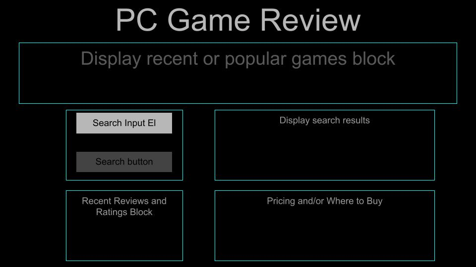

# pc-game-reviews

## User Story
AS A PC game user 
I WANT to compare reviews and pricing
SO THAT I can purchase games that best suit my interests

## Product Description 
PC Game Reviews- is a dynamic web application where a user can search for a game. The results will display game reviews, game rating, and purchase price. Recently searched games will save in local storage and persist on refresh so the user will have a reference. We are looking to provide users a link to purchase a game from steam.

## API'S we will use
Cheapshark-API.  Steam-API. 

## Wireframe

